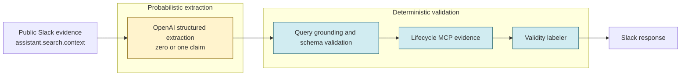

# TruthExpiry

**Similarity is not validity.**

TruthExpiry searches public Slack evidence, extracts a concrete claim, checks it against lifecycle records, and deterministically tells users whether it is **current**, **superseded**, **conflicting**, or **unverified**.

<!-- M5_MEDIA: insert final hero screenshot and video link after capture -->

## What you get in practice

Synthetic demo scenarios from the repository lifecycle dataset:

| Question | Result | Lifecycle proof |
| --- | --- | --- |
| Is report export available on Starter? | **SUPERSEDED** | PROD-482 (`disabled` supersedes `enabled`) |
| Is report export disabled on Starter? | **CURRENT** | PROD-482 |
| Tell me about report export on Starter. | No claim invented | Informational query rejected |
| Is the API rate limit 100 requests for Starter? | **SUPERSEDED** | PROD-511 (`50` supersedes `100`) |
| Is the API rate limit 50 requests for Starter? | **CURRENT** | PROD-511 |

## Architecture



**Authority boundary:** the model proposes structure only. Deterministic code grounds the claim, fetches lifecycle evidence, and assigns **CURRENT**, **SUPERSEDED**, **CONFLICTING**, or **UNVERIFIED**. The model never assigns validity.

Full diagram source: [`docs/architecture/truthexpiry-architecture.mmd`](docs/architecture/truthexpiry-architecture.mmd)

## Why this exists

Slack search can return a statement that *sounds* right because it is semantically similar to what the user asked. That message may already be obsolete. **Similarity alone cannot decide whether a claim remains valid.** TruthExpiry separates “what someone said in Slack” from “what the organization’s lifecycle records say today.”

## How it works

1. A user **mentions the app** or sends a **direct message**.
2. **Socket Mode** delivers the event to the worker.
3. **`assistant.search.context`** retrieves **public-channel** message evidence (one RTS call per request).
4. **OpenAI** extracts **zero or one** structured claim using opaque evidence IDs (`evidence-1`, …).
5. **Deterministic code** grounds the claim against the query and catalog schema, then queries the **lifecycle MCP**.
6. The **deterministic labeler** assigns the final validity result and the worker replies in Slack.

There is no cross-turn conversation memory and no durable store of Slack message bodies.

## Validity states

| State | Meaning |
| --- | --- |
| **CURRENT** | The stated value matches authoritative lifecycle evidence for the claim key. |
| **SUPERSEDED** | A newer lifecycle record replaces the value implied by the claim. |
| **CONFLICTING** | Multiple authoritative lifecycle sources disagree and precedence does not resolve them. |
| **UNVERIFIED** | Lifecycle evidence is missing or unavailable for a grounded claim. |

A query may also produce **no structured claim** when it is informational (“tell me about…”), value-less (“what is the rate limit?”), contradictory in polarity, or unsupported by the query text.

## Technical differentiator

### Probabilistic (OpenAI only)

- Structured extraction of **zero or one** claim per request.
- Fixed model (`openai:gpt-4.1-mini`), **20-second** timeout, **retries disabled**.
- Receives bounded query text and opaque evidence IDs — **not** lifecycle records.
- **Never** decides CURRENT, SUPERSEDED, CONFLICTING, or UNVERIFIED.

### Deterministic (TruthExpiry code)

- Claim-schema catalog and query-value grounding.
- Evidence-ID mapping and structured-output validation.
- Lifecycle record interpretation via MCP.
- Validity label assignment and fail-closed fallbacks when extraction or evidence is unavailable.

Repository-level evidence: [`docs/submission/technical-proof.md`](docs/submission/technical-proof.md)

## Slack integration

| Property | Behavior |
| --- | --- |
| Event delivery | Socket Mode |
| Entry points | App mentions and direct messages |
| Evidence API | `assistant.search.context` |
| Search scope | **Public channels only** (`search:read.public`) |
| RTS calls | One per invocation |
| Action token | Request-scoped; required for live RTS; never logged |

**Important:** a user may invoke TruthExpiry from a DM, but evidence search still covers **public workspace messages only**. Private channels, DMs, and MPDMs are not searched.

## Security and privacy

- **Public evidence only** for workspace search — no private-channel retrieval.
- **No persistence** of Slack message bodies across requests.
- **Opaque request-local evidence IDs** in the extraction prompt; lifecycle records are **not** sent to OpenAI.
- **Bearer-authenticated** lifecycle MCP transport (token in header, not URL).
- **Health/readiness** responses expose bounded operational state only.
- **Logs** omit raw queries, evidence text, tokens, prompts, and provider output.
- **Metrics** use bounded labels (no high-cardinality query or user labels).
- **Demo preflight** prints variable names and safe states only — never secret values.

These are engineering guarantees documented in the repository, not formal compliance certifications.

## Demo preparation

| Document | Purpose |
| --- | --- |
| [`docs/demo/README.md`](docs/demo/README.md) | Demo operator guide (startup, reset, retake rules) |
| [`docs/demo/recording-script.md`](docs/demo/recording-script.md) | Timed recording script and narration |
| [`docs/demo/shot-list.md`](docs/demo/shot-list.md) | Screenshot and asset capture checklist |
| [`docs/demo/preflight.md`](docs/demo/preflight.md) | Read-only readiness checks before recording |
| [`docs/demo/live-acceptance.md`](docs/demo/live-acceptance.md) | Final acceptance matrix (unsigned until live run) |
| [`docs/demo/troubleshooting.md`](docs/demo/troubleshooting.md) | Recovery guide during demo prep |

```powershell
python scripts/demo_preflight.py --profile live
python scripts/demo_preflight.py --profile backup-a
python scripts/demo_preflight.py --profile backup-b
```

| Profile | What it validates |
| --- | --- |
| `live` | Live Slack, RTS, OpenAI extraction, and lifecycle MCP |
| `backup-a` | Live Slack/RTS/MCP with **fake** extractor — must be disclosed if used |
| `backup-b` | Local repository, dataset, and structural checks only |

`READY TO RECORD` means **configuration and infrastructure readiness** — not proof that a live Slack query succeeded.

## Quick start

**Requirements:** Python **3.10+** (container images use 3.12). See [`pyproject.toml`](pyproject.toml).

```powershell
python -m venv .venv
.\.venv\Scripts\Activate.ps1
python -m pip install -e ".[dev]"
copy .env.sample .env
```

Edit `.env` using [`.env.sample`](.env.sample) — never commit real credentials.

### Local structural verification

No live Slack, OpenAI, or MCP network activity:

```powershell
python app.py --check
python -m lifecycle_mcp.server --check
python scripts/demo_preflight.py --profile backup-b
```

### Run services locally

**Terminal 1 — lifecycle MCP:**

```powershell
python -m lifecycle_mcp.server
```

**Terminal 2 — Slack worker:**

Unset `TRUTH_EXPIRY_USE_FAKES` and configure live mode variables from `.env.sample`:

- `SLACK_BOT_TOKEN`, `SLACK_APP_TOKEN` (required for any Socket Mode worker, including fakes mode)
- `TRUTH_EXPIRY_LIFECYCLE_MCP_URL`, `TRUTH_EXPIRY_LIFECYCLE_MCP_AUTH_TOKEN`
- `TRUTH_EXPIRY_CLAIM_EXTRACTOR=live` and `OPENAI_API_KEY` for live extraction

```powershell
python app.py
```

For local MCP development without bearer auth, set `TRUTH_EXPIRY_LIFECYCLE_MCP_AUTH_DISABLED=1` on the MCP server process only.

## Docker

Multi-stage **wheel-based** images run as non-root user `truthexpiry` (UID 10001).

```powershell
docker build -f Dockerfile -t truthexpiry-worker:local .
docker build -f Dockerfile.lifecycle-mcp -t truthexpiry-lifecycle-mcp:local .
docker run --rm truthexpiry-worker:local --check
docker run --rm truthexpiry-lifecycle-mcp:local --check
```

Image entrypoints are `python app.py` and `python -m lifecycle_mcp.server`; append `--check` for structural validation.

| Service | MCP port | Health port | Worker health |
| --- | --- | --- | --- |
| Lifecycle MCP | 8000 | 8001 | — |
| Slack worker | — | — | 8080 (`/healthz`, `/readyz`) |

Optional local wiring:

```powershell
docker compose up
```

Compose runs MCP with auth disabled and the worker in **fake mode** (`TRUTH_EXPIRY_USE_FAKES=1`). Slack tokens are still required for Socket Mode. Compose is a **local smoke aid**, not the production deployment contract. No cloud platform is prescribed.

## Health and operations

| Probe | Worker | Lifecycle MCP |
| --- | --- | --- |
| Liveness | `GET /healthz` → 200 while process is up | `GET /healthz` on health port |
| Readiness | `GET /readyz` → 200 when Socket Mode and MCP are ready | `GET /readyz` after dataset load and tool registration |

During a **temporary MCP outage**, the worker stays **live** (`/healthz` 200) but **unready** (`/readyz` 503). Readiness recovers when MCP returns — **without restarting the worker**. Graceful shutdown drains in-flight requests before exit.

Optional: metrics on port 9090 (`TRUTH_EXPIRY_METRICS_ENABLED=1`) and in-memory event-ID deduplication (`TRUTH_EXPIRY_DEDUP_EVENT_IDS=1`).

Details: [`docs/MILESTONE_4.md`](docs/MILESTONE_4.md), [`docs/runbooks/deployment.md`](docs/runbooks/deployment.md), [`docs/runbooks/secrets-rotation.md`](docs/runbooks/secrets-rotation.md)

## Tests and verification

Automated checks (offline — no Slack, OpenAI, or MCP credentials required for the test suite):

| Check | Command |
| --- | --- |
| Full suite | `pytest -q` |
| Integration | `pytest -q tests/integration/` |
| Lint | `ruff check .` |
| Format | `ruff format --check .` |
| Types | `mypy truthexpiry adapters lifecycle_mcp listeners agent scripts` |
| Dependencies | `pip-audit -r requirements.txt` |

CI workflows in [`.github/workflows/`](.github/workflows/):

- `tests.yml` — unit and integration tests
- `ruff.yml` — lint and format
- `security.yml` — dependency audit
- `containers.yml` — container build smoke

Factual verification record: [`docs/submission/technical-proof.md`](docs/submission/technical-proof.md)

## Project structure

| Path | Role |
| --- | --- |
| `listeners/` | Slack event parsing and response rendering |
| `adapters/` | Slack RTS, OpenAI extraction, lifecycle MCP clients |
| `truthexpiry/services/` | Pipeline orchestration, deterministic labeler, claim schema |
| `truthexpiry/ops/` | Health, metrics, shutdown, Socket Mode wiring |
| `lifecycle_mcp/` | Independently deployable lifecycle evidence server |
| `scripts/demo_preflight.py` | Read-only demo readiness command |
| `docs/` | Architecture, demo guides, milestones, runbooks |

## Limitations

- **Public Slack evidence only** — by design for the hackathon demo scope.
- **Synthetic lifecycle dataset** (`lifecycle_mcp/data/lifecycle_records.json`) — not a live Jira integration.
- **No durable cross-turn memory** — each request is independent.
- **Live extraction** depends on OpenAI availability; failures fail closed with a generic message.
- **Optional event deduplication** is in-memory only — not a durable store.
- **Deployment platform** is neutral; containers and runbooks are provided without prescribing a cloud vendor.

## Documentation

| Resource | Link |
| --- | --- |
| Architecture source | [`docs/architecture/truthexpiry-architecture.mmd`](docs/architecture/truthexpiry-architecture.mmd) |
| Technical proof | [`docs/submission/technical-proof.md`](docs/submission/technical-proof.md) |
| Asset export guide | [`docs/assets/README.md`](docs/assets/README.md) |
| Milestones M1–M5 | [`docs/MILESTONE_1.md`](docs/MILESTONE_1.md) … [`docs/MILESTONE_5.md`](docs/MILESTONE_5.md) |
| Agent / reviewer guides | [`AGENTS.md`](AGENTS.md), [`REVIEW.md`](REVIEW.md) |

## License

[MIT](LICENSE)
